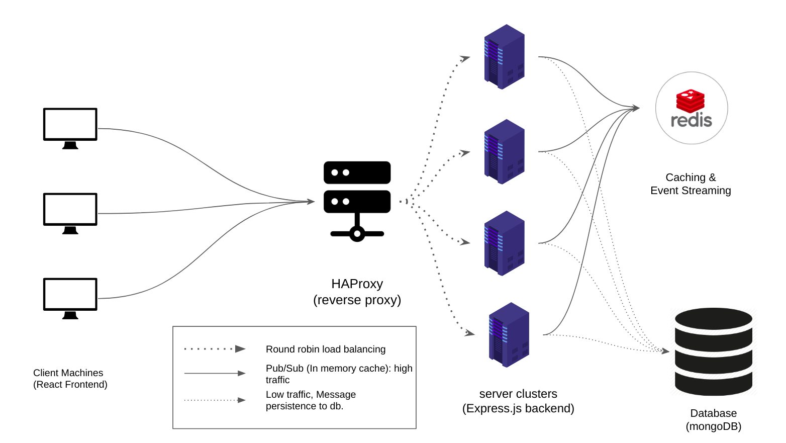
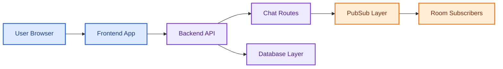

# Distributed Real-Time Chat Application

<p align="center">
  
  
  
  
</p>

A distributed, room-based real-time chat application with a Python backend and frontend interface. The project demonstrates chat rooms, message routing, backend APIs, frontend templates, Docker support, and Pub/Sub-style design for horizontally scalable real-time communication.



## What It Demonstrates

- Real-time chat application structure.
- Backend APIs for chat routes and message models.
- Pub/Sub boundary for distributed message delivery.
- Frontend templates and JavaScript chat behavior.
- Docker and Docker Compose backend setup.
- Separation between backend service and frontend client.

## Architecture



## Repository Map

```text
backend/app/main.py              Backend entry point
backend/app/routes/chat_routes.py Chat route definitions
backend/app/models/chat.py       Chat message models
backend/app/pubsub.py            Pub/Sub message boundary
backend/docker-compose.yml       Backend local infrastructure
frontend/app.py                  Frontend application
frontend/templates/              Chat UI pages
frontend/static/                 CSS and JavaScript assets
```

## Run Locally

Backend:

```powershell
cd backend
pip install -r requirements.txt
uvicorn app.main:app --reload
```

Frontend:

```powershell
cd frontend
pip install -r requirements.txt
python app.py
```

## Revision Notes

- Chat systems need message fan-out, room membership, and delivery semantics.
- A Pub/Sub boundary makes it easier to scale beyond one backend instance.
- Frontend and backend should communicate through stable APIs or websocket-style channels.

## Interview Talking Points

```text
This project is useful for explaining distributed chat fundamentals: clients connect to
a frontend, messages go through backend chat routes, and Pub/Sub fan-out allows room-based
broadcasting while keeping the service scalable.
```
